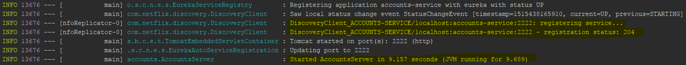
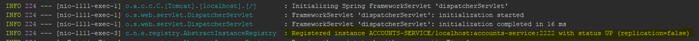
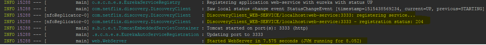
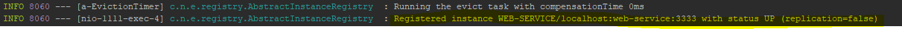
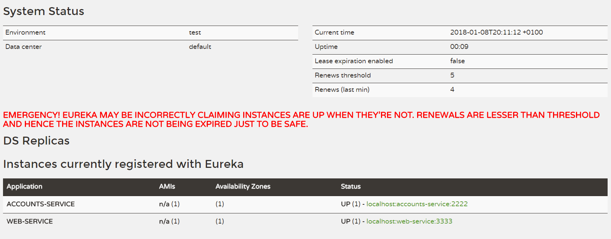
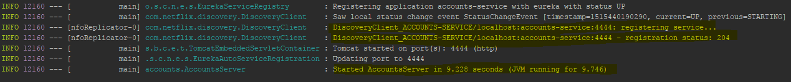
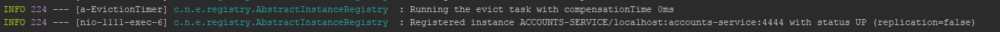
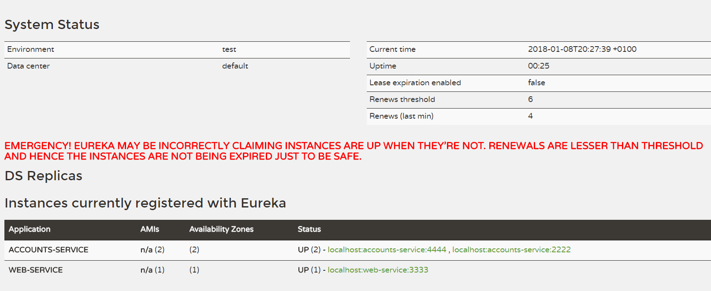

# Web Engineering 2017-2018 / Microservices

## Brief report

* The two microservices are running and registered

Image 1. Account service is running and registered

Image 2. Account service is registered in Registration Server

Image 3. Web service is running and registered

Image 4. Web service is registered in Registration Server

 

* The service registration service has the two microservices registered

Image 5. Registration Server Dashboard

 

* A second account microservice is running in the port 4444 and it is registered

Image 6. Another Account service is running and registered

Image 7. Another Account service is registered in Registration Server

Image 8. Registration Server Dashboard with another Account Service added

 

* A brief report describing what happens when you kill the microservice with port 2222. Can the web service provide information about the accounts? Why?

The web service knows that there are two account microservices, since they are duplicated.
This cause that the web service will be able to communicate with both of them, 
depending on which one the Eureka registration services provide.

If we kill the account service in the port 2222, the web service will continue using 
this service **until Eureka update its list of available services**, and therefore realizes
that the service is offline.